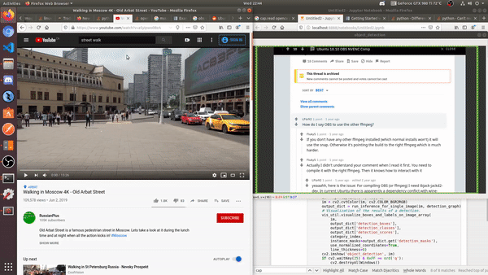
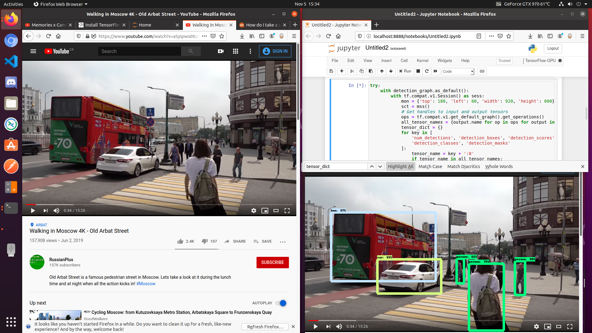
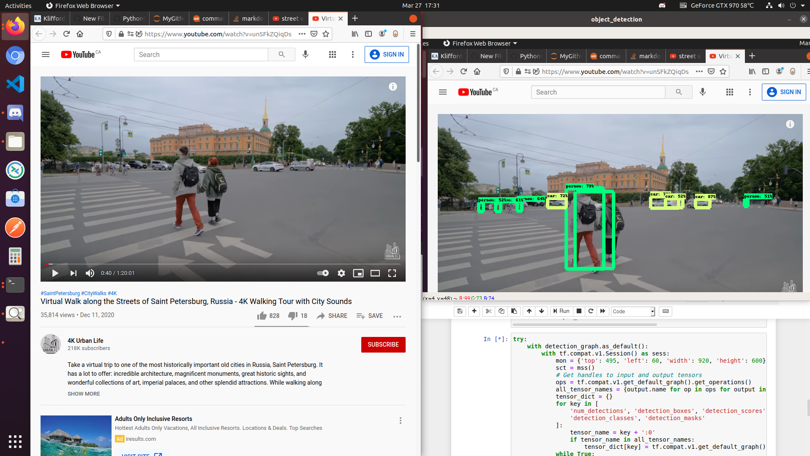

# PythonObjectDetection
Python object detection in real time using COCO Dataset

Make sure to change the `mon` object value on the seventh cell depending on the position of what you want to monitor and how big do you want it to be.

tested on Ubuntu 20.04 with TensorFlow cuda support.

# Screenshots:

